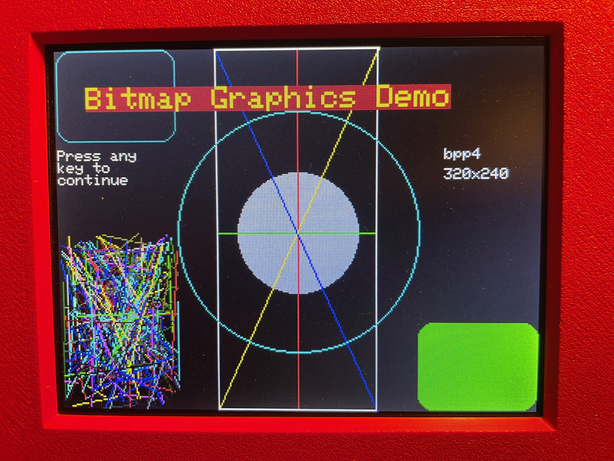

# RP6502-Bitmap-Graphics

This library was written to simplify bitmap graphics programming on the [Picocomputer 6502](https://picocomputer.github.io/).

This code is an adaptation of the vga_graphics library written by [V. Hunter Adams from Cornell University](https://github.com/vha3/Hunter-Adams-RP2040-Demos/tree/master/VGA_Graphics/VGA_Graphics_Primitives), for his excellent RP2040 microcontroller programming course.

The project includes an example, bitmap_graphics_demo.c, to demonstrate use of the library.

